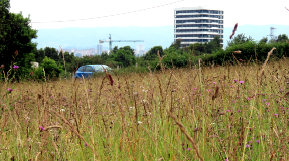

```{r setup, include=FALSE}
knitr::opts_chunk$set(echo = TRUE)
```



# Compositional novelty of plant, fungal and bacterial communities across urban habitats

This repository stores all the information related to the manuscript *Compositional novelty of plant, fungal and bacterial communities across urban habitats*, including the datasets, the scripts to perform data cleaning and analysis, and the `Rmarkdown` files to create the manuscript.

# Abstract

Understanding urban community novelty can help to predict the rewilding potential of vacant urban spaces, facilitating their integration into biodiverse cities. We tested the hypothesis that cities are composed of different degrees of ecological novelty by studying four urban habitats with differing degrees of management and human legacy: park lawns, roadsides, residential vacant lots, and industrial vacant lots. We focused on community compositional novelty, by comparing the plant, fungal and bacterial species composition between urban habitats and two reference pre-urban habitats: forests and meadows. We used a compositional novelty index based on multidimensional ordination, which is straightforward to calculate and only requires species co-occurrence data for urban and reference habitats. As expected, (1) plants displayed the highest novelty and bacteria the lowest; (2) urban communities were markedly different from forests and relatively more similar to meadows; and (3) compositional novelty was highest in industrial lots. Managed park lawns, which we had expected to be highly novel, were relatively close to hay meadows. The lowest novelty was recorded in residential vacant lots, which had biological communities that more closely resembled those of pre-urban habitats. Our results highlight the effect of habitat type as a major driver of urban community composition and novelty. This suggests that city biodiversity can be enhanced by an integrative approach to the urban landscape that favors habitat heterogeneity by passive rewilding of park lawns, non-intervention on residential vacant lots, direct restoration of industrial lots, and conservation of natural and agricultural habitat remnants as sources of native species.

# Keywords

Urban biodiversity, vegetation, soil fungi, soil bacteria, DNA metabarcoding, soil pollution, novel ecosystems

## Contents

This repository is organised following the advice of [Wilson et al. 2017](https://doi.org/10.1371/journal.pcbi.1005510) for recording and storing research projects.

The following materials are available in the folders of this repository:

* `data` Data files including the soil, plant, fungi and bacteria data.
* `src` Scripts in `R` language used to perform the analyses and create the figures.
* `results` Output of the `R` scripts, including figures and supplementary material.
* `doc` Files to create the [manuscript](https://github.com/efernandezpascual/xixon/blob/master/doc/manuscript.md) using `Rmarkdown`.

## Citation

Please cite the repository, datasets and article as: 

> Fernández-Pascual E, Ferencova Z, González-García, Jiménez-Alfaro B. Compositional novelty of plant, fungal and bacterial communities across urban habitats