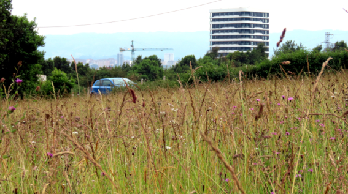

README.md
================

# Compositional novelty of plant, fungal and bacterial communities across urban habitats

This repository stores all the information related to the manuscript
*Compositional novelty of plant, fungal and bacterial communities across
urban habitats*, including the datasets, the scripts to perform data
cleaning and analysis, and the `Rmarkdown` files to create the
manuscript.

## Contents

This repository is organised following the advice of [Wilson et
al. 2017](https://doi.org/10.1371/journal.pcbi.1005510) for recording
and storing research projects.

The following materials are available in the folders of this repository:

- `data` Data files including the soil, plant, fungi and bacteria data.
- `src` Scripts in `R` language used to perform the analyses and create
  the figures.
- `results` Output of the `R` scripts, including figures and
  supplementary material.
- `doc` Files to create the
  [manuscript](https://github.com/efernandezpascual/xixon/blob/master/doc/manuscript.md)
  using `Rmarkdown`.

## Citation

Please cite the repository, datasets and article as:

> Fernández-Pascual E, Ferencova Z, González-García, Jiménez-Alfaro B.
> Compositional novelty of plant, fungal and bacterial communities
> across urban habitats
