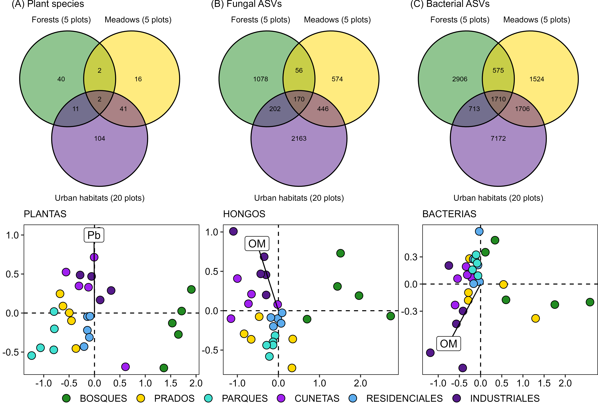
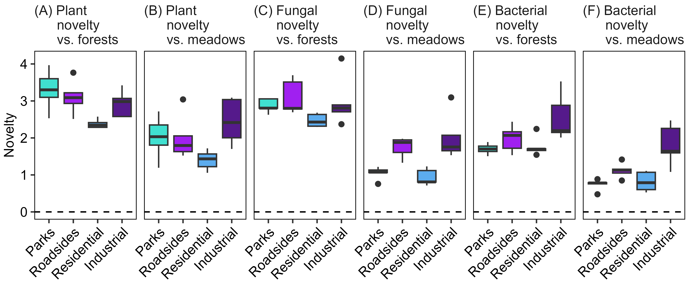

```{r setup, include=FALSE}
knitr::opts_chunk$set(echo = TRUE)
```

```{r message = FALSE, echo = FALSE, warning = FALSE}
knitr::knit_hooks$set(inline = function(x) {
  prettyNum(x, big.mark = ",")
})
```

Running title: Compositional novelty across urban habitats

# Abstract (250 words)

Understanding urban community novelty can help to predict the rewilding potential of vacant urban spaces, facilitating their integration into biodiverse cities. We tested the hypothesis that cities are composed of different degrees of ecological novelty by studying four urban habitats with differing degrees of management and human legacy: park lawns, roadsides, residential vacant lots, and industrial vacant lots. We focused on community compositional novelty, by comparing the plant, fungal and bacterial species composition between urban habitats and two reference pre-urban habitats: forests and meadows. We used a compositional novelty index based on multidimensional ordination, which is straightforward to calculate and only requires species co-occurrence data for urban and reference habitats. As expected, (1) plants displayed the highest novelty and bacteria the lowest; (2) urban communities were markedly different from forests and relatively more similar to meadows; and (3) compositional novelty was highest in industrial lots. Managed park lawns, which we had expected to be highly novel, were relatively close to hay meadows. The lowest novelty was recorded in residential vacant lots, which had biological communities that more closely resembled those of pre-urban habitats. Our results highlight the effect of habitat type as a major driver of urban community composition and novelty. This suggests that city biodiversity can be enhanced by an integrative approach to the urban landscape that favors habitat heterogeneity by passive rewilding of park lawns, non-intervention on residential vacant lots, direct restoration of industrial lots, and conservation of natural and agricultural habitat remnants as sources of native species.

# Keywords (7)

Urban biodiversity, vegetation, soil fungi, soil bacteria, DNA metabarcoding, soil pollution, novel ecosystems

# Highlights (3 to 5, 85 words each)

* A compositional novelty index based on multidimensional ordination is straightforward to calculate and only requires species co-occurrence data for urban and reference pre-urban habitats. 
* Novelty was the highest for plant communities and the lowest for soil bacteria. 
* Urban communities were markedly different from forest communities and relatively more like meadow communities.
* Compositional novelty was highest in industrial vacant lots, and lowest in residential vacant lots. 
* Park lawns were relatively close in composition to hay meadows.

# Introduction

Urban development affects landscape composition and related biodiversity patterns worldwide [@RN5627]. Urbanization converts natural and agricultural habitats into a fine-scale mosaic of diverse urban habitats varying in size, fragmentation, past and present land uses, and degrees of human intervention [@RN5527]. At the same time, novel urban habitats experience climatic differences from the surrounding landscape, as well as high within-city microclimatic variation [@RN5601; @RN5603]. Urban soils likewise vary in permeability, compaction, organic matter content and human-concentrated chemicals [@RN5623; @RN5603]. 

Urban habitats are colonized by organisms from the regional species pool that are capable of living in urban environments [@RN2300]. The process of colonization requires species to pass through a series of hierarchical filters (biogeographical, abiotic, biotic and human) resulting in the formation of an urban species pool and the assembly of specialized urban communities [@RN5505; @RN2306]. Urbanization promotes specialized ruderal species and traits [@RN5613; @RN5622; @RN5679], and thus urban communities are rich in species that can tolerate urban disturbance, drought and pollution [@RN5603]. For this reason, the urban biota can be a source of nature-based solutions, such as the bioremediation of degraded soils [@RN5447; @RN5449] and ecosystem design [@RN5628; @RN5629]. Urban communities also host a high proportion of the regional biodiversity [@RN5600; @RN5682] and make up a major part of the supply of natural elements in densely populated landscapes [@RN5445]. Proper management of urban communities can turn them into assets with high ecological and social returns [@RN5446; @RN5676; @RN5678].

The diversity of urban communities can be characterized along two axes: naturalness and novelty [@RN5445]. Naturalness refers to the degree of self-organization, i.e., the extent to which community composition and functions are self-assembled or dependent on direct human inputs [@RN5445]. Novelty refers to the degree of differentiation from the historical reference communities that existed in the area before urbanization [@RN5673; @RN5674]. For example, urban communities under direct human management (e.g., park lawns) should have low naturalness and high novelty. When management stops, naturalness increases, and the community can either transition back to a state resembling the historical reference (e.g., a low novelty hay meadow) or into a novel assemblage of species (e.g., a high novelty urban grassland with non-native species) [@RN5673; @RN5674]. The fate of a specific urban site will depend on the interaction between the legacy of human intervention and inherent site characteristics [@RN2305]. Intense human legacies usually push communities into novel states, often dominated by non-native and otherwise unwanted taxa [@RN5603; @RN5604], which usually require more intensive and costly actions to restore the land for conservation purposes [@RN2305]. Understanding the patterns and drivers of urban community novelty can help to predict the restoration and rewilding potential of vacant urban spaces, facilitating their integration into the management of biodiversity in cities.

The goal of this article was to test the hypothesis that urban habitats are comprised of different degrees of ecological novelty [@RN5674]. We addressed this hypothesis by studying four urban habitats representing different land uses and human legacies, from managed park lawns to relatively unmanaged strips of land along transportation corridors, physically altered soils in residential vacant lots, and highly contaminated industrial brownfields. To address community compositional novelty, we compared the plant, fungal and bacterial species composition between urban habitats and two reference pre-urban habitats: forest remnants and hay meadows. We expected novelty to be the highest for plants, which in many cases are the object of direct management and introduction [@RN5493]; and lowest for bacteria, which should be less affected than fungi by the usually alkaline urban soils [@RN5603]. We expected novelty to be higher when urban habitats are compared to natural habitats (forests), and lower when compared to agricultural habitats (meadows). We also expected novelty to be higher in the actively managed habitat (park lawns) and in the unmanaged habitat with the highest human legacy (industrial brownfields). Finally, we expected that compositional novelty would be related to soil physicochemical properties, reflecting the major aspect of human legacy in urban habitats. To test these expectations, we tackled three main research goals: (1) to characterize the variation in soil properties across urban and pre-urban habitats; (2) to characterize the variation in plant, fungal and bacterial communities across urban and pre-urban habitats; and (3) to measure the compositional novelty across habitats and taxonomic groups.

# Materials and methods

## Study city

Gijón/Xixón is a medium-sized coastal city (c. 270,000 inhabitants; Instituto Nacional de Estadística) located in the Bay of Biscay, within the central Asturias metropolitan area (c. 800,000 inhabitants) of northern Spain. The city belongs to the Cantabrian Mixed Forests ecoregion [@RN5493; @RN5600], at the border between the temperate and Mediterranean climatic zones of Europe. Climate is temperate oceanic with cool summers and wet and mostly frost-free winters (mean annual temperature = 13.5 ºC, annual precipitation = 1062 mm; 1981-2010 data provided by Agencia Estatal de Meteorología). Most of the city is built on alluvial and estuarine deposits, sand or limestone bedrock. The potential pre-human vegetation was likely dominated by deciduous mixed forests, together with riparian forests, wetlands and coastal dunes. The area has a long history of human habitation dating back to the Cantabrian Upper Paleolithic [@RN5450]. The city itself has been inhabited at least since Roman times [@RN5532]. During the medieval and early modern times, the urban center was limited to the original walled city, with fishing being the main economic activity. Expansion beyond the original core started in the 18th and 19th centuries. Exposure to global trade networks and the warm temperate climate turned the region into a hotspot for biological invasions, especially from the Americas and Asia [@RN5493]. In 1852, the city was connected by railway to regional mining and industrial centers and became a major shipping port [@RN5675]. During the following century the city experienced significant industrial development (e.g., canning, coal, steel, shipbuilding) and rapid population growth, becoming the most populated city in the Principality of Asturias [@RN5683]. Industrial and urban growth brought environmental problems including loss of natural wetlands and air and watercourse pollution [@RN5535]. Starting in the 1970s, the city and the metropolitan area have been affected by post-industrial land-use changes leaving large abandoned industrial sites (i.e., brownfields) [@RN5448; @RN5449].

## Definition of urban habitats

To survey urban biodiversity across habitats, we defined six habitat types (**Figure 1A**) representing different theoretical states of naturalness and novelty [@RN5445]: (1) forest patches \< 10 km from the city center, i.e., remnants of pre-urban natural habitats; (2) late mown hay meadows, i.e., remnants of pre-urban agricultural habitats; (3) park lawns, i.e., green spaces created and maintained by humans; (4) roadsides, i.e., relatively unmanaged strips of land alongside roads and train tracks; (5) residential vacant lots, i.e., currently unmanaged land which has suffered some degree of soil physical disturbance and is waiting to be urbanized; and (6) industrial vacant lots, i.e., currently unmanaged land with an intense legacy of soil disturbance and contamination.

## Sampling plots

During June 2023, we surveyed the city to establish five sampling plots (4 x 4 m) per each of the six habitat types (n = 30 plots). The same plot size was maintained in the forest patches for comparability. The plots were distributed across the city (**Figure 1B**) and represent the variation of vegetation types found within each habitat type. In one plot per habitat (**Figure 1B**), we buried a datalogger (M-Log5W, GeoPrecision, Ettlingen, Germany; accuracy: +/- 0.1 ºC (at 0 ºC), resolution: 0.01 ºC) at a depth of 5 cm below the upper layer of the soil. Dataloggers recorded temperature hourly for one year (1 Jan to 31 Dec 2024), after which we downloaded their records to describe the thermal environment of the city and the habitats.

```{r fig1, echo = FALSE, fig.cap = "Pre-urban and urban habitats included in this study. (A) Representative pictures of each habitat, indicating their level of naturalness (i.e., degree of ecosystem self-organization) and novelty (i.e., degree of divergence from pre-human reference ecosystems). (B) Location of the sampling plots within the city of Gijón/Xixón, Asturias, Spain, Western Europe. Each plot (dots) is colored according to habitat type. A thermometer to the right of the sampling plot indicates that a soil temperature datalogger was installed there."}
knitr::include_graphics("../results/figures/Fig1.png")
```

## Soil physicochemical sampling

From each of the 30 plots, we collected 500 g of soil to analyse soil physicochemical properties. We took the samples from 5 points in each plot (center + 4 cardinal points), down to a depth of 10 cm. We removed stones and other debris, sieved the soils in a 5 mm mesh and homogenized the samples in a plastic bag. Samples were analyzed at INEA Laboratory (Valladolid, Spain), following the standard methodology of the Spanish Ministry of Agriculture [@RN5599]. Soil analysis included pH, texture, bulk density, electrical conductivity, organic matter content, total N, C/N ratio, active limestone, total carbonates, assimilable P, K, Ca, Mg, Na and heavy metals (Zn, Cr, Cu, Cd, Hg, Pb, Ni).

## Plant, fungal and bacterial diversity sampling

In each plot, we recorded all the spontaneous vascular plant species, as well as the cover (%) of each species in the plot. Plant species names follow Euro+Med [@RN5044]. Additionally, from each of the 30 plots, we collected soil samples for DNA metabarcoding of fungal and bacterial (including Archaea) communities. We performed the sampling in sterile conditions, and always before entering the plot for any of the other tasks. We cleaned and sterilized all tools with water and ethanol between samples. In each plot, we took samples from the four cardinal points, 0.5 m inwards from the edge, at a depth of 5 cm. Before taking the samples, we removed the vegetation with a sterile tool. Then, we collected the soil samples in a 50 ml Falcon tube, mixed them, homogenized them with a lancet and finally stored the sample in a 2 ml Eppendorf tube which we immediately froze. The frozen tubes were sent to AllGenetics & Biology SL (A Coruña, Spain) for DNA metabarcoding analysis. The DNA analysis included DNA extraction; library preparation with 2 pairs of different primers specific for barcoding (ITS for fungi, and 16S for bacteria); sequencing on an Illumina NovaSeq PE250 platform (assuming an amplicon size \< 450 bp); and standard bioinformatic analysis including demultiplexing, quality control and sample preprocessing, inference of Amplicon Sequence Variants (ASVs), taxonomic assignment, number of reads per taxon and generation of rarefaction curves (see **Supplementary material 1** for extended DNA metabarcoding methodology).

## Statistical analysis and compositional novelty index

We performed all analyses using R version 4.3.1 [@RN5387] and the package *tidyverse* [@RN4662] for data manipulation and visualization. To describe soil temperatures as recorded by the dataloggers, we calculated the mean annual temperature, the mean diurnal range and the annual range. To assess the variability in soil physicochemical properties, we conducted a Principal Component Analysis (PCA) as implemented in the R package *FactoMineR* [@RN3166] and a correlation analysis to detect auto-correlated soil variables. Multivariate analyses of community composition were performed in *vegan* [@RN5386]: we used PERMANOVA to test differences between habitat types in their soil variables and their composition of plant species, fungal ASVs and bacterial ASVs; Non-metric Multi-Dimensional Scaling (NMDS, see details below) ordination to assess variation in taxonomic composition of plants (for comparison with fungal and bacterial communities, we used presence/absence of plant species, instead of cover), fungi (presence/absence of ASVs) and bacteria (presence/absence of ASVs); and environmental fitting to test the correlation between community ordination axes and soil physicochemical properties.

To calculate a compositional novelty index, we used the NMDS multidimensional distance from each urban plot (i.e., park, roadside, residential or industrial) to the centroid of the two reference pre-urban habitats (i.e., forests and meadows). We calculated compositional novelty separately for plant, fungal and bacterial communities. Because NMDS employs an iterative algorithm to seek optimal solutions, the results may vary across different computational runs, leading to inconsistencies in ordination outcomes. Therefore, we also considered alternative ordination methods based on eigenvalue decomposition (Principal Component Analysis PCA with Hellinger transformation, and Principal Coordinates Analysis PCoA of a Bray–Curtis dissimilarity matrix). The final output and interpretation of the analyses remained stable independently of the ordination method used, and therefore we decided to use NMDS for the final presentation of results, since it makes fewer assumptions about data and is therefore a more flexible technique that can be applied to a wider variety of datasets. We computed NMDS using the Bray-Curtis distance. When using NMDS for assessing variation in taxonomic composition, we fitted the analysis to 2 dimensions, since the goal was visualization of the biplot. In this case, the best solution was achieved after 20 runs for plants (stress = 0.15), 20 runs for fungi (stress = 0.12) and 20 runs for bacteria (stress = 0.09). When using NMDS for calculating novelty, we fitted the analysis to 4 dimensions, to allow for a better fit. In this case, the best solution was achieved after 20 runs for plants (stress = 0.08), 20 runs for fungi (stress = 0.07) and 20 runs for bacteria (stress = 0.04). The plot-centroid distances (i.e., the novelty index) were calculated by summing the distances in each of the four dimensions.

After calculating the novelty indices, we tested the effect of taxonomic group (plant, fungi and bacteria), pre-urban reference habitat (forest or meadow), urban habitat (park, roadside, residential or industrial) and soil physicochemical variables (after reducing their dimensionality by ordination analysis, see results for more details) on compositional novelty, by fitting a Linear Mixed Model with the package *nlme* [@RN2333]. Total sample size in the model was 120 (5 plots x 4 urban habitats x 2 reference habitats x 3 taxonomic groups). Because each sampling plot was included in the model six times (2 reference habitats x 3 taxonomic groups), the model included plot as a random factor. We checked and confirmed model assumptions using the package *performance* [@RN5684]. 

# Results

## Soil properties across habitats

Soil temperature records (**Figure 2A**) indicated that the forest soil was relatively buffered in its thermal range of variation, with a mean annual temperature of 13.9 ºC, a mean diurnal range of 1.8 ºC and an annual range of 10.8 ºC. Meadow and urban plots had more thermal oscillation, with a mean annual temperature between 12.4 ºC (roadsides) and 16.8 ºC (meadows), a mean diurnal range between 3.8 ºC (roadsides) and 4.6 ºC (residential lots), and an annual range between 16.5 ºC (residential lots) and 19.5 ºC (meadows). 

The PCA ordination of the soil physicochemical properties (**Supplementary material 2**) indicated that the first axis of variation, explaining 23% of the variance, ordered soils according to the concentration of heavy metals. The variables with the highest contribution to this axis (\> 10%) were the soil contents in Pb, Cu, Zn, Cd and Cr. This first axis did not separate urban from pre-urban habitats: for example, while some industrial lots had a very high concentration of Pb and other metals, the median Pb value of the industrial habitat was below the median value of forests (**Figure 2B**; **Supplementary material 2**).

The second PCA axis (**Supplementary material 2**) explained 21% of the variance and ordered soils according to their compaction and water retention capacities, with the highest contributing variables (\> 10%) being organic matter content, bulk density, N concentration and pH. This axis separated soils according to their habitat: for example, forests had high organic matter and N content, while industrial vacant lots had higher bulk density and pH (**Figure 2B**; **Supplementary material 2**). 

The third PCA axis (**Supplementary material 2**) explained 10% of the variability and ordered soils according to their content in Mg, with the highest contributing variables (\>10%) being Mg content, Mg/K ratio and conductivity. In this case, as for the first axis, there was no clear separation between habitats, with industrial sites having some of the highest and lowest values (**Figure 2B**; **Supplementary material 2**). 

The analysis showed strong correlations within the groups of variables contributing to the first, second and third PCA axes (**Supplementary material 2**). For further analyses we kept these three axes as explanatory variables. For simplicity, we will refer to each axis by the name of the explanatory variable most strongly associated with that axis (PC1 = Pb; PC2 = organic matter (OM); PC3 = Mg). 

As previously indicated by PCA, organic matter was the only soil property with a clear pattern of variation by habitat: a decrease from pre-urban to urban habitats (**Figure 2B**). PERMANOVA supported that there was not a significant difference between habitats in their soil physicochemical properties (100,000 permutations, R^2^ = 0.19, F = 1.15, p = 0.31).

```{r fig2, echo = FALSE, fig.cap = "Soil properties across habitats. (A) Temperature recorded every hour in one sampling plot per habitat from 1 Jan 2024 to 31 Dec 2024, indicating the hourly records (shaded colors) and the daily averages (full colors). (B) Soil physicochemical properties. Values are shown for the three most explanatory and uncorrelated variables: soil Pb content, soil organic matter content, and soil Mg content."}
knitr::include_graphics("../results/figures/Fig2.png")
```

## Plant, fungal and bacterial communities across habitats

The survey of spontaneous plant diversity yielded 216 species, with the average richness per plot being 26 (min = 10, max = 38). Of these species, 48% were found only in urban habitats (parks, roadsides, residential lots and industrial lots), 27% occurred only in pre-urban habitats (forests and meadows) and 25% were shared by both urban and pre-urban habitats (**Fig3A**). On average, the habitat with the highest richness per plot was industrial lots (29 species), followed by residential lots (27), roadsides (24), meadows (23), parks (20) and forests (18). The most frequent species were *Holcus lanatus* (22 plots), *Plantago lanceolata* (20), *Helminthotheca echioides* (16), *Dactylis glomerata* (15) and *Lotus corniculatus* (14). PERMANOVA supported that the plant species composition was significantly different across habitats (100,000 permutations, R^2^ = 0.42, F = 3.48, p = \< 0.001). The NMDS ordination of the plant species composition (**Fig. 3D**) indicated that the plots belonging to the same habitat were relatively grouped together. The major gradient in vegetation composition along the first axis was a separation between forest plots and the other habitats. Environmental fitting of the soil property axes PC1, PC2, and PC3 onto the ordination indicated that only PC1 (mainly explained by Pb) had a significant correlation (R^2^ = 0.29, p = 0.008) with the plant community composition. High values of Pb (and other heavy metals) were associated with the plant communities from industrial vacant lots and roadsides (**Fig. 3D**).

The DNA metabarcoding of soil fungal communities resulted in 4,689 amplicon sequence variants (ASVs). Of these, 46% were only found in urban habitats (parks, roadsides, residential lots and industrial lots), 36% occurred only in pre-urban habitats (forests and meadows) and 18% were shared by both urban and pre-urban habitats (**Fig3B**). The average number of ASVs per plot was 340 (min = 174, max = 587), with the habitat averages decreasing from residential vacant lots (415) to forests (393), meadows (336), parks (323), industrial vacant lots (300) and roadsides (276). The majority of ASVs were assigned to Ascomycota (56%), followed by Basidiomycota (24%), Rozellomycota (10%) and Glomeromycota (4%). Forest habitats had the highest proportion of Basidiomycota (25% vs. \< 17% in the other habitats) and the lowest proportion of Ascomycota (57% vs. \> 64%). The proportion of Rozellomycota was similar across habitats (from 6% in meadows to 11% in parks). The proportion of Glomeromycota varied between 5% in meadows to 0.5% in forests. PERMANOVA performed on the presence/absence of ASVs indicated significant differences in composition between habitats (100,000 permutations, R^2^ = 0.33, F = 2.39, p = \< 0.001). The NMDS ordination of the fungal ASV composition (**Fig. 3E**) behaved similarly to the ordination of plant communities, with plots tending to group by habitat, and the major compositional gradient reflecting the separation between forest plots and the rest. Environmental fitting of the soil property axes PC1, PC2, and PC3 onto the ordination indicated that only PC2 (mainly explained by organic matter) had a significant correlation (R^2^ = 0.46, p \< 0.001) with the fungal community composition. Low organic matter content was associated with the fungal communities from industrial vacant lots and roadsides (**Fig. 3E**).

For bacterial communities, DNA metabarcoding yielded 16,306 ASVs. Of these, 44% were found only in urban habitats (parks, roadsides, residential lots and industrial lots), 31% occurred only in pre-urban habitats (forests and meadows) and 25% were shared by both urban and pre-urban habitats (**Fig3C**). The average number of ASVs per plot was 1769 (min = 1478, max = 2074), with the habitat averages decreasing from roadsides (1848) to industrial lots (1794), residential lots (1792), meadows (1775), parks (1706) and forests (1697). The majority of ASVs were assigned to Proteobacteria (22%), Planctomycetota (15%), Actinobacteriota (15%) and Acidobacteriota (10%). Compared to other habitats, forests had higher proportions of Proteobacteria and Acidobacteriota, a lower proportion of Actinobacteriota, and a similar proportion of Planctomycetota. PERMANOVA performed on the presence/absence of ASVs indicated significant differences in composition between habitats (100,000 permutations, R^2^ = 0.32, F = 2.51, p = \< 0.001). The NMDS ordination of the bacterial ASV composition (**Fig. 3F**) resulted in less grouping by habitat than for plants and fungi, but still reflected a main compositional gradient from forests to industrial vacant plots. As in the case of the fungal communities, environmental fitting of the soil property axes PC1, PC2, and PC3 onto the ordination indicated that only PC2 (mainly explained by organic matter) had a significant correlation (R^2^ = 0.39, p = 0.001) with the bacterial community composition. Low organic matter content correlated with the communities from industrial vacant lots and roadsides (**Fig. 3F**).

```{r fig3, echo = FALSE, fig.cap = "Plant, fungal and bacterial diversity across habitats. Top panels show Venn plots for the shared numbers of (A) plant species, (B) fungal ASVs and (C) bacterial ASVs between pre-urban (forests, meadows) and urban (parks, roadsides, residential lots and industrial lots) habitats. Bottom panels show biplots of community composition ordination produced by Non-metric Multi-Dimensional Scaling (NMDS). The NMDS were conducted for (D) the plant survey (by species presence/absence), (E) the soil fungal survey (by ASV presence/absence) and (F) the soil bacterial survey (by ASV presence/absence). Colors indicate the habitat. In the biplots, arrows and labels indicate soil variables with a significant correlation with the composition of the communities."}

```

## Compositional novelty across habitats and taxonomic groups

We used the NMDS multidimensional compositional distance from each of the urban plots (i.e., park, roadside, residential or industrial) to the centroid of the two reference pre-urban habitats (i.e., forests and meadows) to calculate a compositional novelty index (**Fig. 4**). Novelty was significantly different between taxonomic groups (F = 40.67, p \< 0.001; see **Supplementary material 3** for full details of the Linear Mixed Model), being higher for plants (2.37 ± 0.34 S.E.) than for fungi (2.15 ± 0.40 S.E.) and bacteria (1.56 ± 0.30 S.E.). Novelty was also significantly different depending on the pre-urban habitat that was used as a reference (F = 227.99, p \< 0.001), being higher compared to forests (2.60 ± 0.28 S.E.) than to meadows (1.46 ± 0.28 S.E.). Nonetheless, for each taxonomic group, there was a high positive correlation between the novelty compared against forests and meadows (r = 0.5 for plants; 0.7 for fungi; 0.9 for bacteria). Different urban habitats also differed significantly in their novelty (F = 10.06, p = 0.001), being higher in industrial vacant lots (2.39 ± 0.32 S.E.) than in roadsides (2.17 ± 0.36 S.E.), parks (1.88 ± 0.42 S.E.) and residential vacant lots (1.66 ± 0.34 S.E.). Of the soil physicochemical properties (i.e., the Pb, organic matter, and Mg axes), only Mg had a marginally significant positive effect on compositional novelty (F = 5.63, p = 0.03).

```{r fig4, echo = FALSE, fig.cap = "Compositional novelty for plants, fungi and bacteria. Compositional novelty was calculated as the NMDS multidimensional distance from each urban plot to the centroid of two reference pre-urban habitats (forests, panels A-C-E; and meadows, panels B-D-F). Novelty was calculated separately for plants (panels A-B), fungi (panels C-D) and bacteria (panels E-F)."}

```

# Discussion

This study shows the compositional novelty of biological communities across urban habitats when they are compared with two reference pre-urban habitats: forest remnants and agricultural hay meadows. As expected, (1) novelty was the highest for plant communities and the lowest for soil bacteria; (2) urban communities were markedly different from forest communities and relatively more similar to meadow communities; and (3) the degree of compositional novelty was the highest among industrial vacant lots. However, managed park lawns, which we had expected to be highly novel, were relatively close in composition to hay meadows. Among urban habitats, the residential vacant lots had the lowest novelty, with biological communities that more closely resembled those of the reference pre-urban habitats. 

## Contrasting diversity patterns in plant-bacterial vs. fungal communities

Our survey found 216 vascular plant species growing in the study plots, representing 9 % of the regional flora [@RN3300]. The highest plant species richness was recorded in vacant industrial and residential plots, while forests displayed the lowest. It must be considered that vacant lots, especially those of industrial origin, had a high number of non-native species, including five that are classified as highly impactful invasives in the ecoregion:  *Buddleja davidii*, *Cortaderia selloana*, *Dittrichia viscosa*, *Paspalum dilatatum* and *Sporobolus indicus* [@RN5493]. Still, vacant lots had more species than forests even considering only native plants. Contrary to plants, fungi had higher richness in our forest plots than in the roadsides or industrial vacant lots, with forests being especially rich in Basidiomycota, as found in other studies [@RN5630; @RN5607]. This agrees with previous reports of fungal communities decreasing with urbanization [@RN5609]. One potential explanation for this decrease is the tendency of urban soils to be alkaline, favoring bacteria over fungi [@RN5603; @RN5606]. Indeed, in our study, organic matter content (highly and inversely correlated with pH) was the soil variable that had an effect on the composition of fungal and bacterial communities; and bacterial richness was higher in urban habitats versus forests (i.e., the opposite to fungi).

## Relatively low novelty in parks lawns and residential vacant lots

We used a compositional novelty index based on multidimensional ordination, which is straightforward to calculate and only requires data on species co-occurrence for urban and reference habitats. As such, this index can help to characterize and compare novelty across urban habitats, which is a major research goal for novel ecosystem research [@RN5673; @RN5674]. Contrary to our expectations, managed park lawns showed a relatively low novelty for all three taxonomic groups when compared to agricultural meadows. This indicates that park lawns have a high potential for low-cost urban rewilding policies, such as low-frequency and late mowing, which could convert lawns into urban grasslands rich in native biota and resembling traditional hay meadows. Urban grasslands are able to hold a high portion of the plant diversity found in their rural counterparts [@RN5677], especially when seminatural habitat remnants are available in the neighboring landscape to serve as a source of species [@RN5611].  We also found that residential vacant lots have a relatively low level of novelty, including a high richness of fungi and native plants. These temporarily unmanaged sites are therefore a highly valuable asset to integrate biodiversity in cities [@RN5445; @RN5446]. Additionally, identifying synanthropic and native species able to thrive in these vacant lots can help to find candidate species for urban landscaping that require low levels of watering, fertilization, weeding or mowing [@RN5614; @RN5678]. Such native and hardy seed mixes are important tools for urban greening, given the increasing awareness of the importance of using locally sourced seed for restoration and rewilding [@RN5617]. 

## Conclusions

Our results highlight the effect of habitat type as a major driver of urban community composition and compositional novelty, supporting the findings of previous studies [@RN5607; @RN5630; @RN5608]. The high impact of habitat types on shaping urban communities and their compositional novelty may be related to the fact that anthropogenic vegetation is highly responsive to habitat-specific disturbance regimes [@RN5600], while soil microbial communities are in turn highly conditioned by plant inputs [@RN5630]. These results suggest that city biodiversity can be enhanced by an integrative approach to the urban landscape that favors habitat heterogeneity by passive rewilding of managed park lawns, non-intervention on residential vacant lots, direct restoration of industrial vacant lots, and conservation of natural and agricultural habitat remnants as sources of native species [@RN5678; @RN5610; @RN5612]. In this way, the potential of urban habitats can be mobilized so they continue to support ecosystem functioning in anthropogenic city landscapes  [@RN5680; @RN5681; @RN5605].

# References

::: {#refs}
:::

# Supplementary

**Supplementary material 1** Extended methodology for the soil DNA metabarcoding analysis.

**Supplementary material 2** Principal Component Analysis and correlation analysis of the soil physicochemical properties.

**Supplementary material 3** Full results of the Linear Mixed Model.