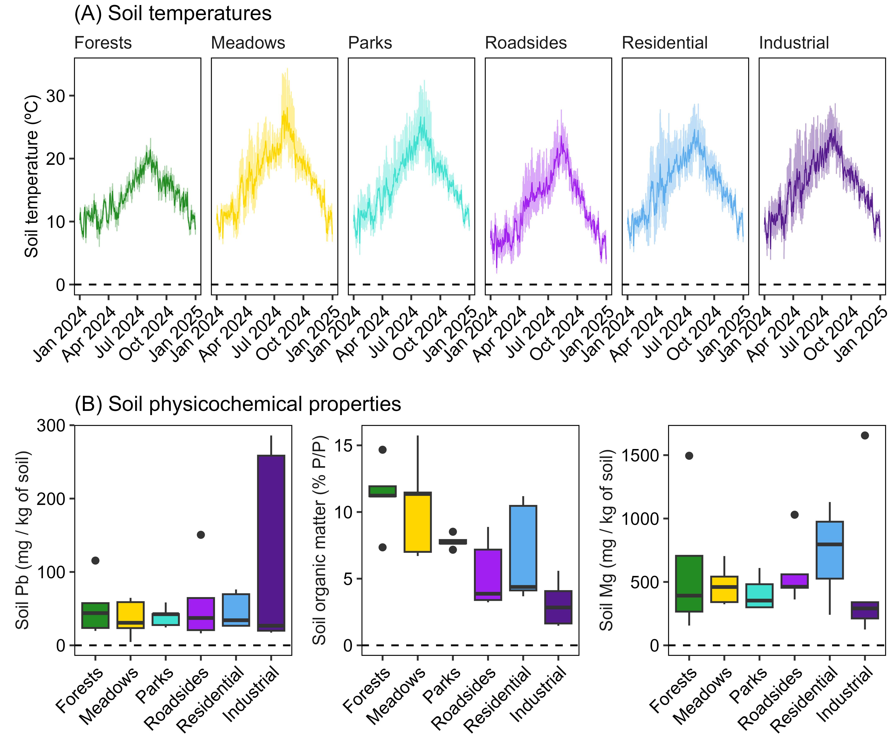
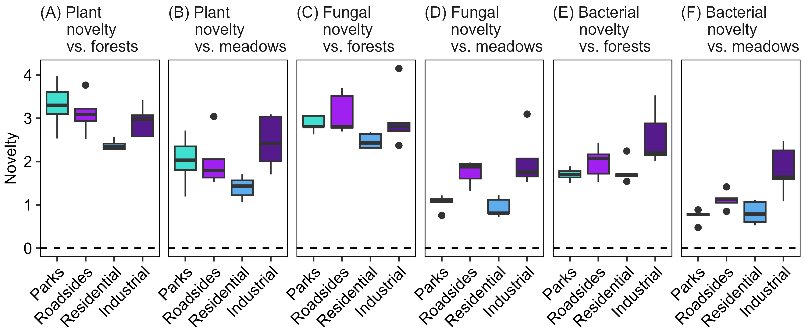

Soil drivers of plant, fungal and bacterial community novelty in urban
habitats of the city of Xixón, Spain
================

Running title: Urban drivers of plant, fungal and bacterial novelty

Eduardo Fernández-Pascual1,a
(<https://orcid.org/0000-0002-4743-9577>), Zuzana Ferencova2
(<https://orcid.org/0000-0002-0915-0916>), Víctor
González-García1 (<https://orcid.org/0000-0002-8949-7943>),
Borja Jiménez-Alfaro1
(<https://orcid.org/0000-0001-6601-9597>)

1 Biodiversity Research Institute (IMIB), University of
Oviedo - CSIC - Principality of Asturias, Mieres, Spain; 2
Jardín Botánico Atlántico, Gijón/Xixón, Spain

Correspondence: Eduardo Fernández-Pascual, Instituto Mixto de
Investigación en Biodiversidad, Campus de Mieres, Edificio de
Investigación, 5ª planta, c/ Gonzalo Gutiérrez Quirós s/n, E-33600
Mieres, Spain. Email: <fernandezpeduardo@uniovi.es>. Telephone:
+34985104781.

# Author contributions

Eduardo Fernández-Pascual: Conceptualization; Methodology;
Investigation; Data Curation; Formal Analysis; Visualization; Writing –
Original Draft Preparation; Writing – Review & Editing. Zuzana
Ferencova: Conceptualization; Methodology; Investigation; Data Curation;
Writing – Review & Editing. Víctor González-García: Investigation; Borja
Jiménez-Alfaro: Methodology; Writing – Review & Editing.

# Acknowledgements

María García Fernández, Sara Gutiérrez Cruz and Abelardo Sigüenza Solís
helped with the field surveys.

# Funding

Fundación Biodiversidad, Ministerio para la Transición Ecológica y el
Reto Demográfico, Gobierno de España \[XIXÓN ECORRESILIENTE, PRTR,
NextGenerationEU\]. Ayuntamiento de Gijón/Xixón, Jardín Botánico
Atlántico \[SV-23-GIJON-JBA\].

# Conflict of interest statement

None declared.

# Data availability statement

Original datasets, R code for analysis and Rmarkdown code for creation
of the manuscript can be accessed at Zenodo:
<https://zenodo.org/doi/10.5281/zenodo.11613571>.

# Introduction

In post-industrial landscapes affected by the phenomenon of urban
contraction, land located in the heart of cities remains unused for long
periods (Haase et al., 2014) . When the use of any urban plot ceases, it
is colonized by plants from the regional flora capable of living in
urban environments (Johnson et al., 2017) . These urban plants are
adapted to disturbances and can grow in degraded soils; some even
accumulate heavy metals, making them nature-based solutions for
bioremediation of degraded lands (Song et al., 2019) . Species traits,
along with the legacy of human impact, determine which regional flora
species colonize which plots (Swan et al., 2021) . When the human legacy
is intense, the plant communities that develop will be novel
communities, different from the historical reference communities that
existed before human intervention (Gedan and Fernández-Pascual, 2019) .
The novelty of the communities can be reflected in their floristic,
compositional and phylogenetic composition, including their proportion
of exotic species (Lososová et al., 2012) . In any case, proper
management of urban communities can turn them into resources with high
ecological and social potential (Anderson and Minor, 2017). (Kowarik,
2018) : in the Ibero-Atlantic ecoregion, anthropogenic habitats can host
up to a third of the ecoregional flora.

The ability of plants to colonize any habitat, including urban ones,
depends largely on their seed regeneration niche, that is, on their
dispersal, persistence, germination and establishment functions (Grubb,
1977, Saatkamp et al., 2019) . However, although it is known that urban
species often share a series of functional and ecological traits
(Aronson et al., 2007, Lososová et al., 2006) , little is known about
their seed regeneration niche. Especially, information on its
germination traits is lacking. In species living in non-anthropogenic
environments, germination phenology is regulated by environmental
factors (water, temperature, light) to ensure that germination occurs at
the right time to maximize subsequent seedling survival (Carta et al.,
2022a) . Compared to the large amount of data on the germination of
species from non-anthropogenic habitats, little is known about what
factors regulate the germination of urban species. Considering other
habitats affected by humans (Fernández-Pascual et al., 2022) , it could
be expected that urban seeds have their germination unrelated to
macroclimatic signals and show tolerance to stress due to heat, drought
or heavy metals. However, this hypothesis needs to be tested through a
synthesis of the seed regeneration niche in urban environments.

Cities 1. highly fragmented landscapes 2. mosaics of heterogeneous
ecosystems (in terms of size, fragmentation, population density and land
use) 3. subject to different degrees of human interference, leading to a
stepwise transformation of pristine ecosystems to novel urban ecosystems
4. comprised of a patchwork of paved and unpaved spaces, built and
vacant land, and newly developed and obsolescent and/or abandoned
buildings and infrastructure 5. contains a multitude of vacant lots,
railway sidings, utility easements, corridors between buildings and
canal sides that are often overgrown with spontaneous vegetation, which
are not coherently managed, and which seem to occupy an uncertain,
interstitial niche in the urban matrix

Cities are comprised of a patchwork of paved and unpaved spaces, built
and vacant land, and newly developed and obsolescent and/or abandoned
buildings and infrastructure. They are mosaics of heterogeneous
ecosystems (in terms of size, fragmentation, population density and land
use) which are subject to different degrees of human interference,
leading to a stepwise transformation of pristine ecosystems to novel
urban ecosystems (Kowarik, 2005).

The “Four Nature approach” narrows down the variety of transformational
stages in urban settings to four major types that can supply wilderness
in urban region (Kowarik 1992, 2005). Each of the four types relates to
nature in general but results from different trajectories in
human-nature interactions:

Spontaneous vegetation appears in different habitat types in the urban
matrix,. Multitude of vacant lots, railway sidings, utility easements,
corridors between buildings and canal sides that are often overgrown
with spontaneous vegetation, which are not coherently managed, and which
seem to occupy an uncertain, interstitial niche in the urban matrix. The
spontaneous herbs could provide the very interesting pool of species for
ecological restoration of the urban area. Their ecological value has
been clear since many years because their contribution to the ecosystem
services in urban areas. Although their aesthetic value has been
highlighted repeatedly, their acceptance by the residents in urban areas
has been questioned. Many residents associate the presence of
spontaneous plants with the neglect in maintenance by public (municipal)
management service. Spontaneous native urban vegetation has commonly
been described as demonstrating resilience (Ignatieva et al., 2000) and
exhibiting adaptations to human disturbance (Lundholm and Marlin, 2006;
Sukopp, 2004).

Urban species pool is comprised of native species present before the
urban development, native species developed because the new urban
ecosystem and introduced species by human activity. However, just some
of them can adapt to urban environment.

IGS (informal green space) consists of any urban space with a history of
strong anthropogenic disturbance that is covered at least partly with
non-remnant, spontaneous vegetation (Del Tredici, 2010).

# Materials and methods

## Study city

Gijón/Xixón is a medium-sized coastal city (population c. 270,000
inhabitants) located in the Bay of Biscay, within the central Asturias
metropolitan area of northern Spain (population c. 800,000 inhabitants).
The city belongs to the Cantabrian Mixed Forests ecoregion ([Olson et
al. 2001](#ref-RN4667)), at the border between the temperate and
Mediterranean climatic zones of Europe, and has a temperate oceanic
climate with cool summers and wet and mostly frost-free winters (mean
annual temperature = 13.5 ºC, annual precipitation = 1050 mm). Most of
the city is built on alluvial and estuarine deposits, sand, or limestone
bedrock. The potential pre-human vegetation would be dominated by
deciduous mixed forests, together with riparian forests, wetlands and
coastal dunes. The area has a long history of human habitation dating
back to the Cantabrian Upper Paleolithic ([Straus 2005](#ref-RN5450)).
The city itself has been inhabited at least since Roman times
([**RN5532?**](#ref-RN5532)). During the medieval and early modern era
the urban center was limited to the original walled city, with fishing
as the main economic activity. Expansion beyond the original core
started in the 18th and 19th centuries. Exposure to global trade
networks and the mild climate turned the region into a hotspot for
biological invasions, especially from the Americas and Asia
([Lázaro-Lobo et al. 2024](#ref-RN5493)). In 1852, the city was
connected by railway and became a major port for the regional mining and
industrial centers. During the 20th century the city experienced
significant industrial development (e.g. canning, coal, steel,
shipbuilding) and rapid population growth, becoming the most populated
city in the Principality of Asturias ([**RN5534?**](#ref-RN5534);
[**RN5533?**](#ref-RN5533)). Industrial and urban growth brought
environmental problems including loss of natural wetlands and air and
watercourse pollution ([**RN5535?**](#ref-RN5535)). Like the rest of its
metropolitan area, the city has been affected by recent post-industrial
land-use changes which have left large areas with abandoned industrial
sites (i.e. brownfields) ([Gallego et al. 2016](#ref-RN5448); [Matanzas
et al. 2021](#ref-RN5449)).

## Definition of urban habitats

To survey urban biodiversity across habitats, we defined six habitats
types (**Figure 1A**) representing different states within the
four-nature classification of urban wilderness ([Kowarik
2018](#ref-RN5445)): (1) forest patches \< 10 km from the city center,
i.e. type-1 nature in remnants of the pre-urban vegetation; (2) hay
meadows, i.e. type-2 nature in remnants of human-made ecosystems
resulting from agricultural habitat transformation; (3) parks,
i.e. type-3 nature in managed green spaces created after habitat
destruction; (4) roadsides, i.e. type-4 nature in relatively unmanaged
strips of land alongside roads, railways, etc; (5) residential lots,
i.e. type-4 nature in unmanaged vacant lots of previous residential use;
and (6) industrial lots, i.e. type-4 nature in unmanaged vacant lots of
previous industrial use.

## Selection of sampling plots

During June 2023, we surveyed the city to establish five 4 x 4 m
sampling plots per each of the six habitat types (n = 30 plots). The
plots were distributed across the city (**Figure 1B**) and represented
the variation of vegetation types found within each habitat type. In two
plots per habitat (**Figure 1B**), we buried a datalogger (M-Log5W,
GeoPrecision, Ettlingen, Germany; accuracy: +/- 0.1 ºC (at 0 ºC),
resolution: 0.01 ºC) at a depth of 5 cm below the upper layer of the
soil. Dataloggers recorded temperature once every hour and stayed on
site for approximately one year, after which we retrieved them and
downloaded their records to describe the thermal environment of the city
and the habitats.

## Soil physicochemical sampling

From each of the 30 plots, we collected 500 g of soil for analysis of
chemical composition and physical soil properties. We took the samples
from 5 points in each plot (center + 4 cardinal points). We removed
stones and other debris particles, sieved the soil in a 5 mm mesh and
homogenized the sample in a plastic bag. We cleaned and sterilized all
tools with water and ethanol between samples. We sent the samples for
analysis at INEA - Escuela Universitaria de Ingeniería Agrícola,
Universidad Pontificia de Comillas. Soil analysis included pH, texture,
bulk density, electrical conductivity, organic matter content, total
nitrogen, C/N ratio, active limestone, total carbonates, assimilable
phosphorus, K, Ca, Mg, Na and heavy metals (Zn, Cr, Cu, Cd, Hg, Pb, Ni).

> Añadir detalles de los métodos de suelo (Zuzana)

## Plant, fungal and bacterial diversity sampling

In each plot, we recorded all the spontaneous vascular plant species, as
well as the cover (%) of each species in the plot. For plant species
names we followed Euro+Med ([Euro+Med 2006](#ref-RN5044)). Additionally,
from each of the 30 plots, we collected soil samples for DNA
metabarcoding analysis of soil fungal and bacterial communities. We
performed the sampling in sterile conditions, i.e. before entering the
plot for any of the other tasks. In each plot, we took samples from the
four cardinal points, 0.5 m inwards from the edge, at a depth of 5 cm.
Before taking the samples, we removed the vegetation with a sterile
tool. Then, we collected the soil samples in a 50 ml Falcon tube, mixed
them, homogenized them with a lancet and finally stored the sample into
a 2 ml Eppendorf tube which we immediately froze. We sent the frozen
tube to AllGenetics & Biology SL (www.allgenetics.eu) for DNA
metabarcoding analysis.

## DNA metabarcoding analysis

DNA analysis by AllGenetics included DNA extraction; library preparation
with 2 pairs of different primers specific for barcoding (ITS for fungi
and 16S for bacteria); sequencing on an Illumina NovaSeq PE250 platform
(assuming an amplicon size \< 450 bp); and standard bioinformatic
analysis including demultiplexing, quality control and sample
preprocessing, taxonomic assignment, number of reads per taxon and
generation of rarefaction curves.

*DNA isolation and quantification*. DNA was isolated from each soil
sample using the DNeasy PowerSoil Pro DNA isolation kit (Qiagen)
following the manufacturer’s instructions, and DNA was eluted in a final
volume of 50 μL. In one sample the above-mentioned protocol did not
yield a DNA extract of enough concentration, so DNA was isolated using
the FastDNA Spin Kit for Soil (MPBio) following the manufacturer’s
instructions, and DNA was eluted in a final volume of 70 μL. An
extraction blank (Bex) was included in each round of DNA extraction, and
treated as the plot samples to check for contamination. DNA
concentration in each extract was quantified using the Qubit High
Sensitivity dsDNA Assay (Thermo Fisher Scientific).

*DNA metabarcoding library preparation and sequencing*. For fungal
library preparation, a fragment of the nuclear ITS1 region of around
280-300 bp (including the primer sequences) was amplified using the
following primers: forward - ITS1f (5’ CTTGGTCATTTAGAGGAAGTAA 3’)
([**RN5548?**](#ref-RN5548)); reverse - ITS2 (5’ GCTGCGTTCTTCATCGATGC
3’) ([**RN5549?**](#ref-RN5549)). For prokaryotic library preparation, a
fragment of the 16S rRNA gene of around 300 bp (including primer
sequences) was amplified using the following primers: forward - 515F-Y
(5’ GTGYCAGCMGCCGCGGTAA 3’) ([**RN5536?**](#ref-RN5536)); reverse -
806RB (5’ GGACTACNVGGGTWTCTAAT 3’) ([**RN5537?**](#ref-RN5537)). These
primers also included the Illumina sequencing primer sequences attached
to their 5’ ends. In the first amplification step, PCRs were carried out
in a final volume of 12.5 μL, containing 1.25 μL of template DNA (1:2
diluted in PCR round 3; not diluted in PCR round 11), 0.5 μM of the
primers, 3.13 μL of Supreme NZYTaq 2x Green Master Mix (NZYTech), and
ultrapure water up to 12.5 μL. The fungal reaction mixture was incubated
as follows: an initial denaturation at 95 ºC for 5 min, followed by 35
cycles of 95 ºC for 30 s, 49 ºC for 45 s, 72 ºC for 45 s, and a final
extension step at 72 ºC for 7 min. The bacterial reaction mixture was
incubated as follows: an initial denaturation at 95 ºC for 5 min,
followed by 25 cycles of 95 ºC for 30 s, 47 ºC for 45 s, 72ºC for 45 s,
and a final extension step at 72 ºC for 7 min. The oligonucleotide
indices that are required for multiplexing different libraries in the
same sequencing pool were attached in a second amplification step with
identical conditions but only 5 cycles and 60 ºC as the annealing
temperature. A negative control that contained no DNA (BPCR) was
included in every PCR round to check for contamination during library
preparation. Library size was verified by running the libraries on 2 %
agarose gels stained with GreenSafe (NZYTech) and imaging them under UV
light. Then, libraries were purified using the Mag-Bind RXNPure Plus
magnetic beads (Omega Bio-tek), following the instructions provided by
the manufacturer. Finished libraries were pooled in equimolar amounts
according to the results of a Qubit dsDNA HS Assay (Thermo Fisher
Scientific) quantification. The pool was sequenced in a fraction of a
NovaSeq PE250 flow cell (Illumina) aiming for a total output of 2
gigabases. Any potential traces of adapter dimers were removed using
Cutadapt v3.5 ([**RN5538?**](#ref-RN5538)). Quality of the sequencing
data was assesed with the software FastQC ([**RN5539?**](#ref-RN5539)).

*Processing of sequencing data and inference of ASVs*. Cutadapt v3.5 was
used to trim off non-biological DNA sequences (primers, indices, and
sequencing adapters). Then, amplicon reads were processed using the
DADA2 pipeline ([**RN5541?**](#ref-RN5541)) implemented in QIIME 2
(release 2023.7) ([**RN5540?**](#ref-RN5540)). The first step in the
DADA2 pipeline was to remove PCR primers and filter reads according to
their quality. After checking the read quality profiles, forward reads
were truncated at position 175, and reverse reads at position 131. The
next step was to denoise and infer Amplicon Sequence Variants (ASVs).
Error rates were learned from the dataset to denoise, using the
parametric error model implemented in DADA2. Dereplication of the
dataset (i.e. combination of all identical reads into unique reads) was
carried out to reduce computational effort. These dereplicated forward
and reverse reads were used to infer ASVs with the core sample inference
algorithm ([**RN5541?**](#ref-RN5541)). Subsequently, corresponding R1
and R2 reads were merged into pairs with a minimum overlap of 12
identical base pairs. The final step in the DADA2 pipeline was to reduce
the impact of artefacts (chimaeras) in the dataset. The final output of
the DADA2 pipeline was a table containing the count of reads of every
observed ASV in each sample, as well as a table listing all ASVs and
their corresponding representative sequences.

*Taxonomic assignment*. Taxonomic assignment of each ASV was performed
using a pre-trained classifier of the UNITE reference database for fungi
([**RN5550?**](#ref-RN5550)) (release May 2021); and of the SILVA
reference database for bacteria ([**RN5542?**](#ref-RN5542)) (release
138.1 August 2020). To compare the representative sequences of the ASVs
to the reference database, and compute the taxonomic assignment,the
algorithm sklearn ([**RN5543?**](#ref-RN5543)) implemented in QIIME 2
was applied, setting a minimum confidence level of 0.8. Several filters
were applied to exclude: (1) singletons (i.e. ASVs containing only one
member sequence in the whole data set); (2) ASVs occurring at a
frequency below 0.01 % in each sample, to reduce the mistagging bias
([**RN5544?**](#ref-RN5544)); (3) from the bacterial dataset,
non-prokaryotic ASVs such as eukaryotic sequences of plastid
([**RN5545?**](#ref-RN5545)) and mitochondrial
([**RN5546?**](#ref-RN5546)) origin; (4) those assigned only at domain
(Bacteria) or kingdom (Fungi) level; (5) ASVs present in the negative
controls that were more abundant in the negative controls than in the
samples, indicating contamination ([**RN5547?**](#ref-RN5547)).

*Alpha rarefaction plots*. Alpha rarefaction plots showed that the
sequencing depth to reach saturation was 30,000 reads for the fungi and
22,000 reads for the bacteria, above the sequencing depth of all plots
for fungi (mean = 114,919 reads; min = 79,045; max = 157,110) and
bacteria (mean = 113,341 reads; min = 84,094; max = 171,404).

> Rarefaction

## Statistical analysis

- Soil temperature indices as worldclim
- Soil PCA, correlation, PERMANOVA
- NMDSs and permanova for plants
- NMDS and permanova for fungi, bacteria, clarify presence absence and
  level of analysis
- enfit

# Results

## Soil properties across habitats

Soil temperature records (**Figure 2A**) indicated that forest soils
were relatively buffered in their range of variation, with a mean annual
temperature of 11.4 ºC, a mean diurnal range of 1.72 ºC and an annual
range of 4.74 ºC. The meadow and urban plots had more thermal
oscillation, with a mean diurnal range above 4 ºC and an annual range
above 10 ºC. PCA ordination of the soil physicochemical properties
(**Appendix S1**) indicated that the first axis of variation, explaining
23% of the variance, ordered the soils according to their concentration
of heavy metals. The variables with the highest contribution to this
axis (\> 10%) were the soil contents in Pb, Cu, Zn, Cd and Cr, which
accounted for 66% of the variability of the first axis. This first axis
did not separate urban from non-urban habitats: for example, vacant
industrial lots had some of the highest concentration in heavy metals,
but also some of the lowest. Likewise, forest plots were distributed
across the first axis. The second axis of variation explained 21% of the
variance and ordered soils according to their compaction and water
retention capacities, with the highest contributing variables (\> 10%)
being organic matter content, bulk density, N concentration and pH,
which made up 59% of the axis’ variability. This axis did separate soils
according to their habitat: for example, forest sites had high organic
matter and N content, while industrial vacant lots had higher bulk
density and pH. The third axis explained 10% of the variability and
ordered soils according to their content in Mg, with the highest
contributing variables (\>10%) being Mg content, Mg/K ratio and
conductivity, together explaining 50% of the axis. In this case, like
for the first axis, there was no clear separation between habitats, with
industrial sites having some of the highest and the lowest values.
Correlation analysis showed strong correlations between the groups of
variables contributing to the first, second and third axes (**Appendix
S1**). Therefore, to avoid autocorrelation issues, for further analyses
we kept the variables Pb content, organic matter content and Mg content
(**Figure 2B**), which together provided a straightforward biological
interpretation of patterns in soil composition. Of these values, as
previously indicated by the PCA, organic matter was the only one with a
clear pattern of variation: a decrease from the non-urban to the urban
habitats. A PERMANOVA of the soil values indicated that there was not a
significant difference between habitats in their soil physicochemical
properties (100,000 permutations, R2 = 0.19, F = 1.15, p =
0.31).

Figure 1: Boxplot of soil properties accross
habitats. (A) Temperatures recorded every hour in one sampling plot per
habitat from 1 Jan 2024 to 31 Dec 2024. (B) Soil physicochemical
properties. Values are shown for the three most explanatory and
uncorrelated variables, as per a previous PCA analysis: soil Pb content,
soil organic matter content, and soil Mg content.

> Poner unidades de las variables en figura

## Plant, fungal and bacterial communities across habitats

The survey of plant diversity yielded 216 species, with the average
number per plot being 26 (min = 10, max = 38). Of these species, 48%
were only found in urban-habitats (parks, roadsides, residential lots
and industrial lots), 27% occurred only in non-urban habitats (forests
and meadows) and 25% were shared by both urban and non-urban habitats
(**Fig3A**). On average, the habitat with the highest number of species
per plot were the industrial lots (29), followed by residential lots
(27), roadsides (24), meadows (23), parks (20) and forests (18). The
most frequent species were *Holcus lanatus* (22 plots), *Plantago
lanceolata* (20), *Helminthotheca echioides* (16), *Dactylis glomerata*
(15) and *Lotus corniculatus* (14). PERMANOVA indicated that the plant
species composition was significantly different accross habitats
(100,000 permutations, R2 = 0.42, F = 3.48, p = \< 0.001).
NMDS ordination of the plant species composition (**Fig. 3D**) indicated
that the plots belonging to the same habitat were relatively grouped
together, with the main exception being one of the roadside plots. The
ordination indicated that the major gradient in vegetation composition
along the first axis was a separation between the forest plots and the
rest, with the meadows being the closest to the forests. Environmental
fitting of the Pb, organic matter and Mg vectors onto the ordination
indicated that none of the soils factors had a significant correlation
(R2 \< 0.14, p \> 0.05) with the composition of the plant
communities.

The DNA metabarcoding of soil fungal communities resulted in 4,689 ASVs.
Of these ASVs, 46% were only found in urban-habitats (parks, roadsides,
residential lots and industrial lots), 36% occurred only in non-urban
habitats (forests and meadows) and 18% were shared by both urban and
non-urban habitats (**Fig3B**). The average number of ASVs per plot was
340 (min = 174, max = 587), with the habitat-averages ranging from
residential vacant lots (415) to forests (393), meadows (336), parks
(323), industrial vacant lots (300) and roadsides (276). The majority of
ASVs were assigned to Ascomycota (56%), Basidiomycota (24%),
Rozellomycota (10%) and Glomeromycota (4%). Of the different habitats,
forests had the highest proportion of Basidiomycota (25% vs. \< 17% in
the other habitats) and the lowest proportion of Ascomycota (57% vs. \>
64%). The proportion of Rozellomycota was similar across habitats (from
6% in meadows to 11% in parks). The proportion of Glomeromycota varied
between 5% in meadows to 0.5% in forests. A PERMANOVA performed on the
presence/absence of ASVs indicated significant differences in
composition between habitats (100,000 permutations, R2 =
0.33, F = 2.39, p = \< 0.001). NMDS ordination of the fungal ASV
composition (**Fig. 3E**) behavead similarly to the ordination of plant
communities, with plots tending to group by habitat, and the major
compositional gradient reflecting the separation between the forest
plots and the rest. Environmental fitting of the Pb, organic matter and
Mg vectors onto the ordination indicated only organic matter content had
a significant correlation (R2 = 0.46, p \< 0.001) with the
composition of the fungal communities. Low organic matter content
correlated with the communities from industrial vacant lots and
roadsides (**Fig. 3E**).

For the bacterial communities, DNA metabarcoding yielded 16,306 ASVs. Of
these ASVs, 44% were only found in urban-habitats (parks, roadsides,
residential lots and industrial lots), 31% occurred only in non-urban
habitats (forests and meadows) and 25% were shared by both urban and
non-urban habitats (**Fig3C**). The average number of ASVs per plot was
1769 (min = 1478, max = 2074), with the habitat-averages ranging from
roadsides (1848) to industrial lots (1794), residential lots (1792),
meadows (1775), parks (1706) and forests (1697). The majority of ASVs
were assigned to Proteobacteria (22%), Planctomycetota (15%),
Actinobacteriota (15%) and Acidobacteriota (10%). Compared to other
habitats, forests had higher proportions of Proteobacteria and
Proteobacteria; a lower proportion of Actinobacteriota; and a similar
proportion of Planctomycetota. A PERMANOVA performed on the
presence/absence of ASVs indicated significant differences in
composition between habitats (100,000 permutations, R2 =
0.32, F = 2.51, p = \< 0.001). NMDS ordination of the bacterial ASV
composition (**Fig. 3F**) resulted in less grouping by habitat than for
the plants and the fungi, but still reflected a main composotional
gradient from forests to industrial vacant plots. Like in the case of
the fungal communities, environmental fitting of the Pb, organic matter
and Mg vectors onto the ordination indicated only organic matter content
had a significant correlation (R2 = 0.39, p = 0.001) with the
composition of the fungal communities. Low organic matter content
correlated with the communities from industrial vacant lots and
roadsides (**Fig. 3F**).

Figure 2: Plant, fungal and bacterial
diversity of the sampling plots. Top panels show Venn plots for the
shared numbers of (A) plant species, (B) fungal ASVs and (c) bacterial
ASVs between urban (parks, roadsides, residential lots and industrial
lots) and non-urban (forests, meadows) habitats. Bottom panels show
biplots of community composition ordinartion produced by Non-metric
Multi-Dimensional Scaling (NMDS). NMDs were conducted for (A) plant
survey (by species abundance), (B) the soil fungal survey (by ASV
presence/absence) and (C) the soil bacterial survey (by ASV
presence/absence). Colors indicate the habitat. In the biplots, arrows
and labels indicate soil variables with a significant correlation with
the composition of the communities. Only soil organic matter content and
fungal-bacterial communities had a significant correlation.

## Community novelty across habitats and taxonomic groups

We used the NMDS multidimensional compositional distance (calculate from
the ordinations in **Fig. 3D-F**) from each urban plot (i.e. park,
roadside, residential or industrial) to the centroid of the two
reference non-urban habitats (i.e. forests and meadows) to calculate for
each plot, taxonomic group and reference habitat a value of community
novelty (**Fig. 4**). The novelty was significantly different between
taxonomic groups (F = 45.88, p \< 0.001), being higher for plants (2.45
± 0.332 S.E.) than for fungi (2.15 ± 0.396 S.E.) and bacteria (1.56 ±
0.303 S.E.). The novelty was also significantly different depending on
the reference non-urban habitat that was used (F = 199.08, p \< 0.001),
being higher compared to forests (2.60 ± 0.287 S.E.) than to meadows
(1.51 ± 0.300 S.E.). Nonetheless, for each taxonomic group, there was a
high positive correlation between the novelty compared against forests
or meadows (r = 0.5 for plants; 0.7 for fungi; 0.9 for bacteria). The
different urban habitats also differed significantly in their novelty (F
= 9.51, p = 0.001), being higher for industrial vacant lots (2.46 ±
0.311 S.E.) than for roadsides (2.18 ± 0.367 S.E.), parks (1.95 ± 0.440
S.E.) and residential vacant lots (1.63 ± 0.307 S.E.). The soil
physicochemical properties (Pb, organic matter, Mg) had no significant
effect on community novelty (p \> 0.05).

Figure 3: Community novelty for plants, fungi
and bacteria. Community novelty was calculated as the multidimensional
distance from each urban plot to the centroid of two reference non-urban
habitats (forests, panels A-C-E; and meadows, panels B-D-F), as
calculated by NMDS ordination. Novelty was calculated separately for
plant (panels A-B), fungal (panels C-D) and bacterial communities
(panels E-F).

## Soil drivers of novelty

# Discussion

The recorded flora represents just a subset of possible spontaneous
vegetation because this study was carried on during limited time which
covers just part of the growing season of the whole vegetation.

There are some other habitats in the city which were not included in the
present study, e.g. wetlands, beach, cliffs.

# Data availability

The original datasets, as well as R code for analysis and creation of
the manuscript can be accessed at the GitHub repository
<https://github.com/efernandezpascual/disturbance>. Upon publication, a
version of record of the repository will be deposited in Zenodo.

# References

Euro+Med. 2006. Euro+Med PlantBase - the
information resource for Euro-Mediterranean plant diversity.
http://ww2.bgbm.org/EuroPlusMed/.

Gallego, J.R., Rodríguez-Valdés, E., Esquinas, N., Fernández-Braña, A.,
& Afif, E. 2016. [Insights into a 20-ha
multi-contaminated brownfield megasite: An environmental forensics
approach](https://doi.org/10.1016/j.scitotenv.2015.09.153).
*Science of The Total Environment* 563-564: 683–692.

Kowarik, I. 2018. [Urban wilderness: Supply,
demand, and access](https://doi.org/10.1016/j.ufug.2017.05.017).
*Urban Forestry & Urban Greening* 29: 336–347.

Lázaro-Lobo, A., Campos, J.A., Díaz González, T.E., Fernández-Pascual,
E., González García, V., Marchante, H., Romero, M.I., & Jiménez-Alfaro,
B. 2024. An ecoregion-based approach to evaluate
invasive species pools. *NeoBiota*

Matanzas, N., Afif, E., Díaz González, T.E., & Gallego, J.R. 2021.
[Phytoremediation potential of native herbaceous
plant species growing on a paradigmatic brownfield
site](https://doi.org/10.1007/s11270-021-05234-9). *Water, Air, &
Soil Pollution* 232: 290.

Olson, D.M., Dinerstein, E., Wikramanayake, E.D., Burgess, N.D., Powell,
G.V., Underwood, E.C., D’amico, J.A., Itoua, I., Strand, H.E., &
Morrison, J.C. 2001. Terrestrial ecoregions of the
world: a new map of life on earth: a new global map of terrestrial
ecoregions provides an innovative tool for conserving
biodiversity. *BioScience* 51: 933–938.

Straus, L.G. 2005. [The Upper Paleolithic of
Cantabrian Spain](https://doi.org/10.1002/evan.20067).
*Evolutionary Anthropology: Issues, News, and Reviews* 14: 145–158.

# Supplementary

**Appendix S1** Principal Component Analysis and correlation analysis of
the soil physicochemical properties.
